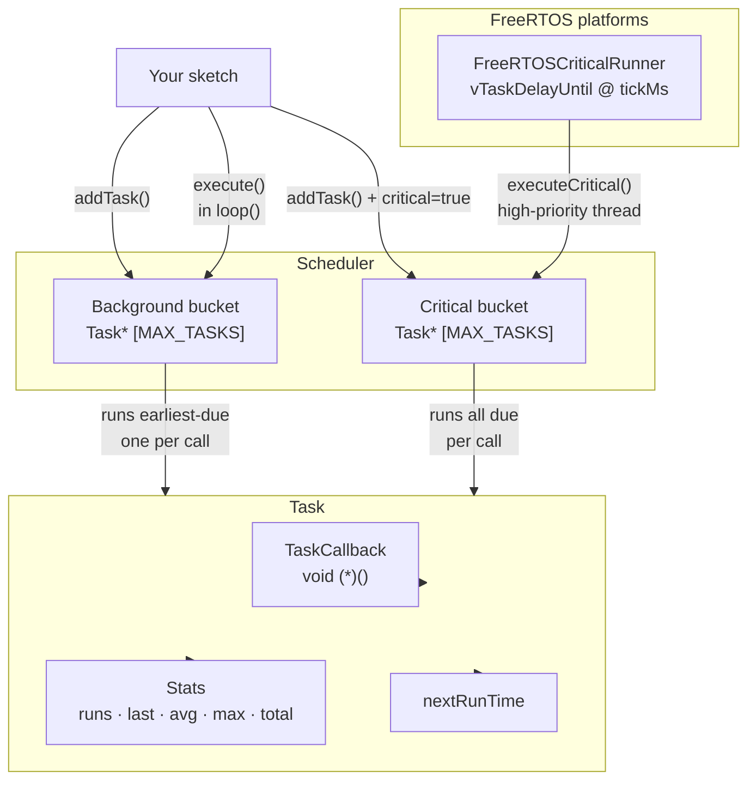

# CriticalTaskScheduler

[](https://www.ardu-badge.com/CriticalTaskScheduler)
[](https://registry.platformio.org/libraries/andrenepomuceno/CriticalTaskScheduler)
[](LICENSE)

*Read this in other languages: [Português](README.pt.md) · [Español](README.es.md) · [中文](README.zh.md)*

Lightweight cooperative task scheduler for **Arduino** and compatible boards.

- **Two execution modes** — *background* (cooperative, runs the earliest-due task per `loop()` call) and *critical* (runs all due tasks; pair with the optional FreeRTOS runner).
- **Portable core** — no `String`, no `std::vector`, no `std::function`; works on AVR, SAMD, RP2040, ESP8266, ESP32, nRF52, and more.
- **Per-task stats** — runs, last/avg/max execution time, total time, next-run time.
- **Pluggable time source** — inject a fake clock for unit tests; default is `millis()`.
- **Optional FreeRTOS critical thread** — auto-detected on ESP32, RP2040, and nRF52. Any other FreeRTOS platform can opt in with `-D CRITICALTASKSCHEDULER_HAS_FREERTOS=1`.

> Battle-tested on a real ESP32-S3 robot in production.

## Install

### Arduino IDE
1. Open *Tools → Manage Libraries…*
2. Search for **CriticalTaskScheduler** and click *Install*.

### PlatformIO
Add to your `platformio.ini`:

```ini
lib_deps = andrenepomuceno/CriticalTaskScheduler@^1.0.0
```

### Manual
Clone or download into your `libraries/` folder:

```bash
git clone https://github.com/andrenepomuceno/CriticalTaskScheduler.git CriticalTaskScheduler
```

## Architecture



## Quick Start

```cpp
#include <CriticalTaskScheduler.h>

TSScheduler sched;

void blink()  { digitalWrite(LED_BUILTIN, !digitalRead(LED_BUILTIN)); }
void status() { Serial.println("alive"); }

TSTask blinkTask("blink",   500,  blink);
TSTask statusTask("status", 1000, status);

void setup() {
    Serial.begin(115200);
    pinMode(LED_BUILTIN, OUTPUT);

    sched.addTask(&blinkTask);
    sched.addTask(&statusTask);
    sched.enableAll();
}

void loop() {
    sched.execute(); // runs the earliest-due background task; never delay()
}
```

See [examples/](examples) for more — including critical-vs-background timing, delayed start, and stats.

## Why another scheduler?

| Feature | This library | `arkhipenko/TaskScheduler` |
|---|---|---|
| Critical (FreeRTOS-thread) tasks | Built-in (ESP32, RP2040, nRF52) | No |
| Earliest-due single-shot in `execute()` | Yes (anti-starvation) | No (runs all due) |
| Per-task `runs/avg/max/total` stats | Built-in | Optional |
| Portable AVR↔ESP32 core | Yes | Yes |
| Static allocation only | Yes (no heap) | Optional |

## Documentation

- [Quick Start](docs/quick-start.md)
- [API Reference](docs/api-reference.md)
- [Timing Semantics](docs/timing-semantics.md) — critical vs background, reschedule rules, jitter
- [Troubleshooting](docs/troubleshooting.md)

## License

MIT — see [LICENSE](LICENSE).
