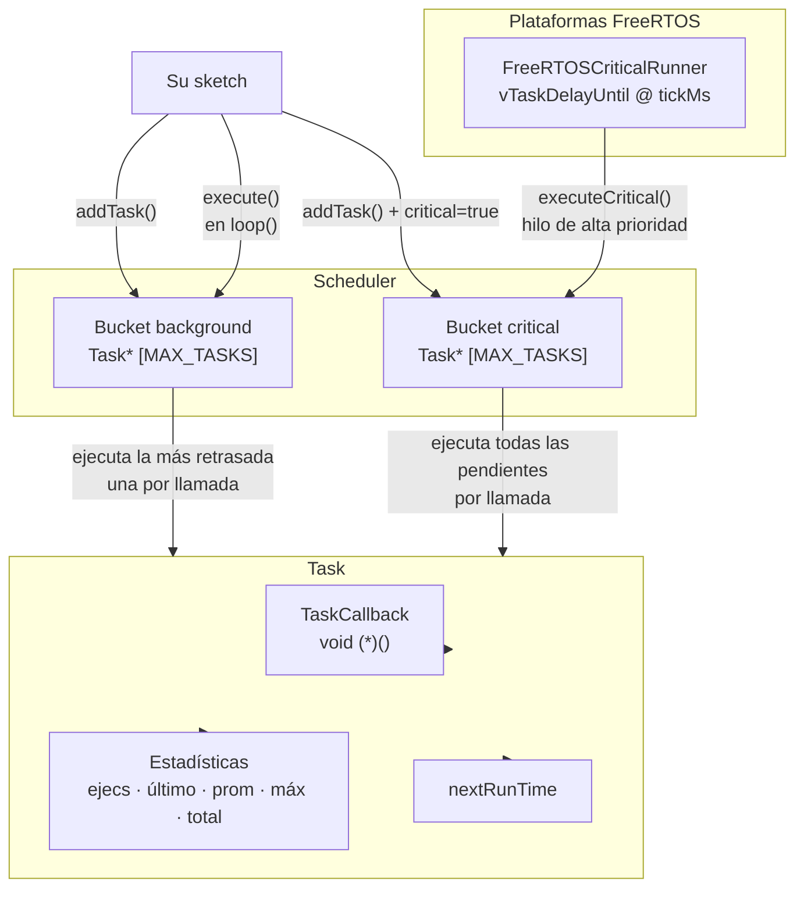

# CriticalTaskScheduler

[](https://www.ardu-badge.com/CriticalTaskScheduler)
[](https://registry.platformio.org/libraries/andrenepomuceno/CriticalTaskScheduler)
[](LICENSE)

*Leer en otros idiomas: [English](README.en.md) · [Português](README.pt.md) · [中文](README.zh.md)*

Planificador cooperativo de tareas ligero para **Arduino** y placas compatibles.

- **Dos modos de ejecución** — *background* (cooperativo, ejecuta la tarea más retrasada por llamada a `loop()`) y *critical* (ejecuta todas las tareas pendientes; combinar con el runner FreeRTOS opcional).
- **Núcleo portátil** — sin `String`, sin `std::vector`, sin `std::function`; compatible con AVR, SAMD, RP2040, ESP8266, ESP32, nRF52 y más.
- **Estadísticas por tarea** — ejecuciones, tiempo último/promedio/máximo/total, próxima ejecución.
- **Fuente de tiempo intercambiable** — inyecte un reloj falso para pruebas unitarias; por defecto usa `millis()`.
- **Hilo crítico FreeRTOS opcional** — detectado automáticamente en ESP32, RP2040 y nRF52. Otras plataformas FreeRTOS pueden activarlo con `-D CRITICALTASKSCHEDULER_HAS_FREERTOS=1`.

> Probado en producción en un robot real ESP32-S3.

## Instalación

### Arduino IDE
1. Abra *Herramientas → Administrar Bibliotecas…*
2. Busque **CriticalTaskScheduler** y haga clic en *Instalar*.

### PlatformIO
Agregue a su `platformio.ini`:

```ini
lib_deps = andrenepomuceno/CriticalTaskScheduler@^1.0.0
```

### Manual
Clone o descargue en su carpeta `libraries/`:

```bash
git clone https://github.com/andrenepomuceno/CriticalTaskScheduler.git CriticalTaskScheduler
```

## Arquitectura



## Inicio Rápido

```cpp
#include <CriticalTaskScheduler.h>

TSScheduler sched;

void parpadear() { digitalWrite(LED_BUILTIN, !digitalRead(LED_BUILTIN)); }
void estado()    { Serial.println("vivo"); }

TSTask parpadearTask("parpadear", 500,  parpadear);
TSTask estadoTask("estado",       1000, estado);

void setup() {
    Serial.begin(115200);
    pinMode(LED_BUILTIN, OUTPUT);

    sched.addTask(&parpadearTask);
    sched.addTask(&estadoTask);
    sched.enableAll();
}

void loop() {
    sched.execute(); // ejecuta la tarea background más retrasada; nunca use delay()
}
```

Consulte [examples/](examples) para más ejemplos — incluyendo temporización crítica vs. background, inicio retrasado y estadísticas.

## ¿Por qué otro planificador?

| Característica | Esta biblioteca | `arkhipenko/TaskScheduler` |
|---|---|---|
| Tareas críticas (hilo FreeRTOS) | Nativo (ESP32, RP2040, nRF52) | No |
| Ejecución única por llamada (más retrasada) | Sí (anti-inanición) | No (ejecuta todas) |
| Estadísticas `ejecuciones/prom/máx/total` | Nativo | Opcional |
| Núcleo portátil AVR↔ESP32 | Sí | Sí |
| Solo asignación estática | Sí (sin heap) | Opcional |

## Documentación

- [Inicio Rápido](docs/quick-start.md)
- [Referencia de API](docs/api-reference.md)
- [Semántica de Temporización](docs/timing-semantics.md) — crítico vs. background, reglas de reprogramación, jitter
- [Solución de Problemas](docs/troubleshooting.md)

## Licencia

MIT — consulte [LICENSE](LICENSE).
