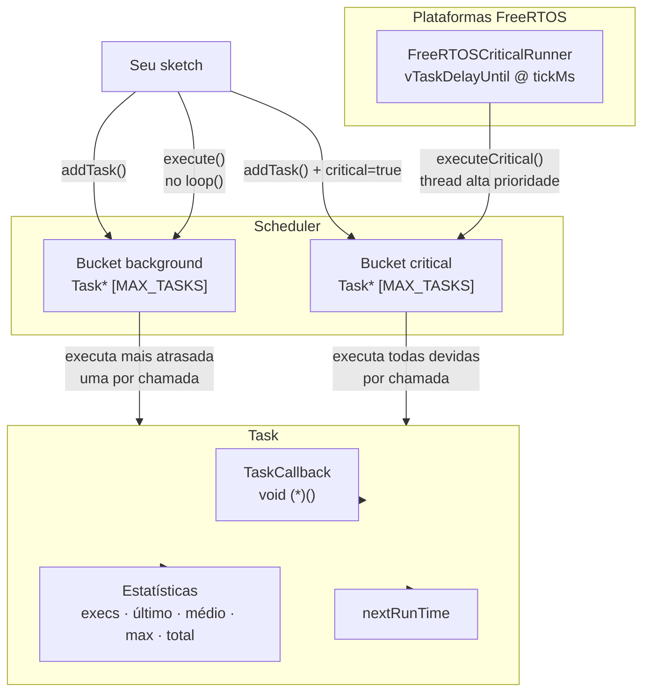

# CriticalTaskScheduler

[](https://www.ardu-badge.com/CriticalTaskScheduler)
[](https://registry.platformio.org/libraries/andrenepomuceno/CriticalTaskScheduler)
[](LICENSE)

*Leia em outros idiomas: [English](README.en.md) · [Español](README.es.md) · [中文](README.zh.md)*

Agendador cooperativo de tarefas para **Arduino** e placas compatíveis.

- **Dois modos de execução** — *background* (cooperativo, executa a tarefa mais atrasada por chamada ao `loop()`) e *critical* (executa todas as tarefas devidas; combine com o runner FreeRTOS opcional).
- **Core portátil** — sem `String`, sem `std::vector`, sem `std::function`; funciona em AVR, SAMD, RP2040, ESP8266, ESP32, nRF52 e mais.
- **Estatísticas por tarefa** — execuções, tempo último/médio/máximo/total, próximo disparo.
- **Fonte de tempo plugável** — injete um clock falso para testes unitários; padrão é `millis()`.
- **Thread crítica FreeRTOS opcional** — auto-detectado em ESP32, RP2040 e nRF52. Qualquer outra plataforma FreeRTOS pode ativar com `-D CRITICALTASKSCHEDULER_HAS_FREERTOS=1`.

> Testado em produção em um robô real ESP32-S3.

## Instalação

### Arduino IDE
1. Abra *Ferramentas → Gerenciar Bibliotecas…*
2. Pesquise por **CriticalTaskScheduler** e clique em *Instalar*.

### PlatformIO
Adicione ao seu `platformio.ini`:

```ini
lib_deps = andrenepomuceno/CriticalTaskScheduler@^1.0.0
```

### Manual
Clone ou baixe na pasta `libraries/`:

```bash
git clone https://github.com/andrenepomuceno/CriticalTaskScheduler.git CriticalTaskScheduler
```

## Arquitetura



## Início Rápido

```cpp
#include <CriticalTaskScheduler.h>

TSScheduler sched;

void piscar()  { digitalWrite(LED_BUILTIN, !digitalRead(LED_BUILTIN)); }
void status()  { Serial.println("vivo"); }

TSTask piscarTask("piscar", 500,  piscar);
TSTask statusTask("status", 1000, status);

void setup() {
    Serial.begin(115200);
    pinMode(LED_BUILTIN, OUTPUT);

    sched.addTask(&piscarTask);
    sched.addTask(&statusTask);
    sched.enableAll();
}

void loop() {
    sched.execute(); // executa a tarefa background mais atrasada; nunca use delay()
}
```

Veja [examples/](examples) para mais exemplos — incluindo temporização crítica vs. background, início atrasado e estatísticas.

## Por que mais um scheduler?

| Recurso | Esta biblioteca | `arkhipenko/TaskScheduler` |
|---|---|---|
| Tarefas críticas (thread FreeRTOS) | Nativo (ESP32, RP2040, nRF52) | Não |
| Execução única por chamada (mais atrasada) | Sim (anti-starvation) | Não (executa todas) |
| Estatísticas `execuções/médio/máx/total` | Nativo | Opcional |
| Core portátil AVR↔ESP32 | Sim | Sim |
| Apenas alocação estática | Sim (sem heap) | Opcional |

## Documentação

- [Início Rápido](docs/quick-start.md)
- [Referência da API](docs/api-reference.md)
- [Semântica de Temporização](docs/timing-semantics.md) — crítico vs. background, regras de reagendamento, jitter
- [Solução de Problemas](docs/troubleshooting.md)

## Licença

MIT — veja [LICENSE](LICENSE).
