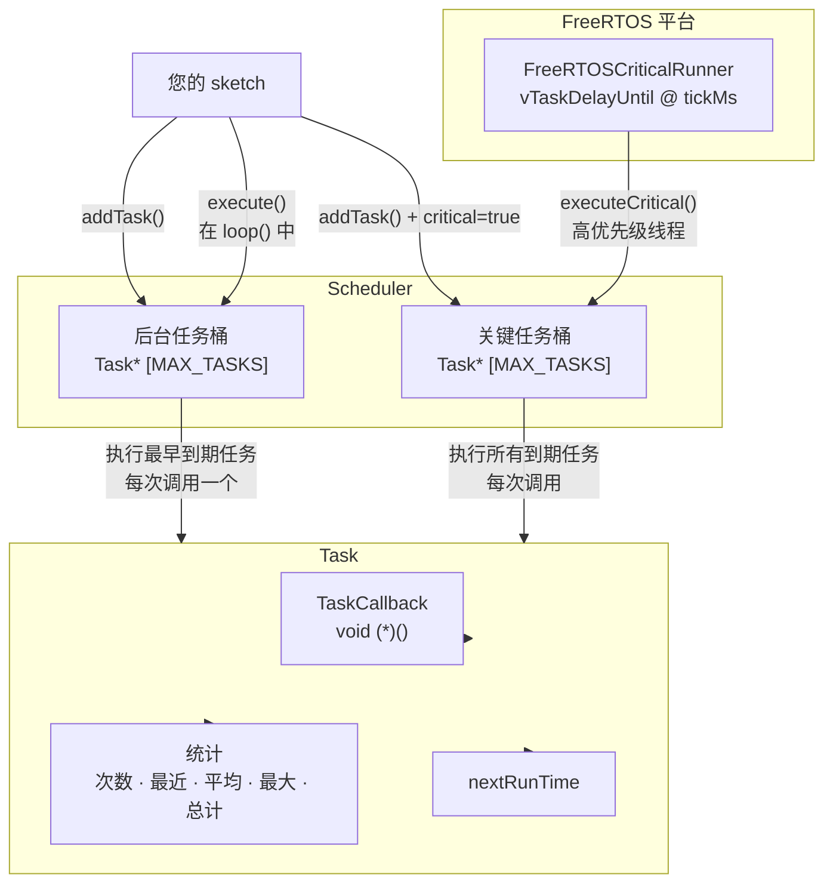

# CriticalTaskScheduler

[](https://www.ardu-badge.com/CriticalTaskScheduler)
[](https://registry.platformio.org/libraries/andrenepomuceno/CriticalTaskScheduler)
[](LICENSE)

*阅读其他语言版本: [English](README.en.md) · [Português](README.pt.md) · [Español](README.es.md)*

适用于 **Arduino** 及兼容开发板的轻量级协作式任务调度库。

- **两种执行模式** — *后台*（协作式，每次 `loop()` 调用执行最早到期的任务）和*关键*（执行所有到期任务；可与可选的 FreeRTOS 运行器配合使用）。
- **可移植核心** — 无 `String`、无 `std::vector`、无 `std::function`；支持 AVR、SAMD、RP2040、ESP8266、ESP32、nRF52 等。
- **每任务统计** — 执行次数、最近/平均/最大/总执行时间、下次执行时间。
- **可插拔时间源** — 可注入伪时钟用于单元测试；默认使用 `millis()`。
- **可选 FreeRTOS 关键线程** — 在 ESP32、RP2040 和 nRF52 上自动检测。其他 FreeRTOS 平台可通过 `-D CRITICALTASKSCHEDULER_HAS_FREERTOS=1` 手动启用。

> 已在真实 ESP32-S3 机器人生产环境中验证。

## 安装

### Arduino IDE
1. 打开 *工具 → 管理库…*
2. 搜索 **CriticalTaskScheduler**，点击 *安装*。

### PlatformIO
在 `platformio.ini` 中添加：

```ini
lib_deps = andrenepomuceno/CriticalTaskScheduler@^1.0.0
```

### 手动安装
克隆或下载到 `libraries/` 文件夹：

```bash
git clone https://github.com/andrenepomuceno/CriticalTaskScheduler.git CriticalTaskScheduler
```

## 架构



## 快速开始

```cpp
#include <CriticalTaskScheduler.h>

TSScheduler sched;

void blink()  { digitalWrite(LED_BUILTIN, !digitalRead(LED_BUILTIN)); }
void status() { Serial.println("alive"); }

TSTask blinkTask("blink",   500,  blink);
TSTask statusTask("status", 1000, status);

void setup() {
    Serial.begin(115200);
    pinMode(LED_BUILTIN, OUTPUT);

    sched.addTask(&blinkTask);
    sched.addTask(&statusTask);
    sched.enableAll();
}

void loop() {
    sched.execute(); // 执行最早到期的后台任务；绝不使用 delay()
}
```

查看 [examples/](examples) 获取更多示例 — 包括关键任务与后台任务的时序对比、延迟启动和统计功能。

## 为什么又造一个调度器？

| 特性 | 本库 | `arkhipenko/TaskScheduler` |
|---|---|---|
| 关键任务（FreeRTOS 线程） | 内置（ESP32、RP2040、nRF52） | 无 |
| 每次调用仅执行最早到期任务 | 是（防饥饿） | 否（执行所有到期） |
| 每任务 `次数/平均/最大/总计` 统计 | 内置 | 可选 |
| AVR↔ESP32 可移植核心 | 是 | 是 |
| 仅静态分配 | 是（无堆） | 可选 |

## 文档

- [快速开始](docs/quick-start.md)
- [API 参考](docs/api-reference.md)
- [时序语义](docs/timing-semantics.md) — 关键任务与后台任务、重调度规则、抖动
- [故障排除](docs/troubleshooting.md)

## 许可证

MIT — 参见 [LICENSE](LICENSE)。
