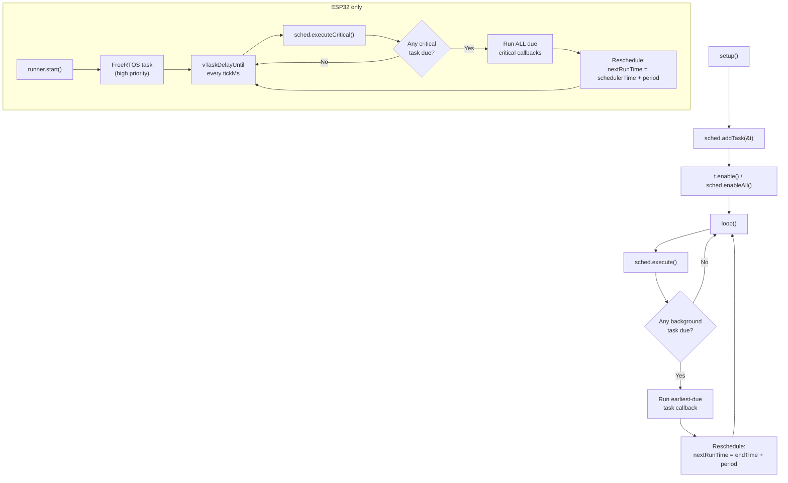

# Quick Start

A 2-minute introduction to **CriticalTaskScheduler**.

## 1. Install

### Arduino IDE
*Tools → Manage Libraries…* → search **CriticalTaskScheduler** → *Install*.

### PlatformIO
```ini
lib_deps = andrenepomuceno/CriticalTaskScheduler@^1.0.0
```

## 2. Minimal sketch

```cpp
#include <CriticalTaskScheduler.h>

TSScheduler sched;

void heartbeat() { Serial.println("alive"); }

TSTask heartbeatTask("heartbeat", 1000, heartbeat);

void setup() {
    Serial.begin(115200);
    sched.addTask(&heartbeatTask);
    heartbeatTask.enable();
}

void loop() {
    sched.execute(); // never delay()
}
```

## 3. Mental model



- A `Task` is a periodic callback (`void()` function pointer) plus stats.
- A `Scheduler` owns two buckets:
  - **Background** tasks — pumped by `execute()` in `loop()`. Runs **one** earliest-due task per call. This is the cooperative core.
  - **Critical** tasks — pumped by `executeCritical()`. Runs **all** due tasks per call. Best driven from a dedicated FreeRTOS thread via `TSFreeRTOSCriticalRunner` (available on ESP32, RP2040, and nRF52; opt in on other FreeRTOS platforms with `-D CRITICALTASKSCHEDULER_HAS_FREERTOS=1`).
- Callbacks must be **non-blocking** — never call `delay()`. Use state machines if you need multi-step logic.

## 4. Next steps

- [Timing Semantics](timing-semantics.md) — when does a task actually fire?
- [API Reference](api-reference.md) — every public method.
- [Troubleshooting](troubleshooting.md) — jitter, missed runs, stack sizing.
- [examples/](../examples) — runnable sketches for each scenario.
