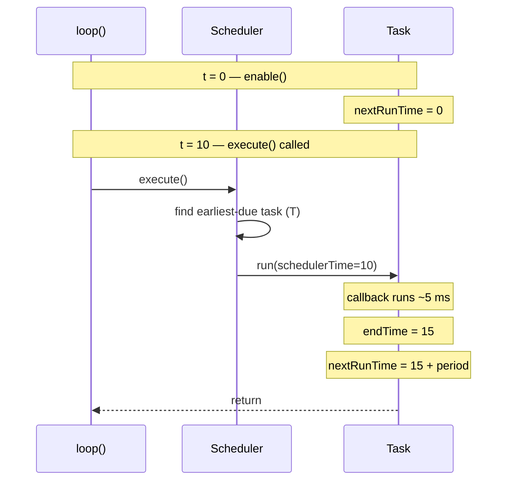
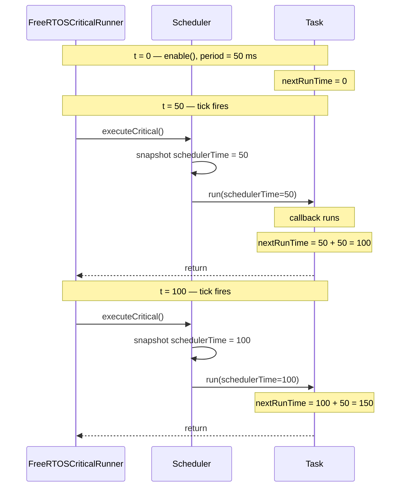
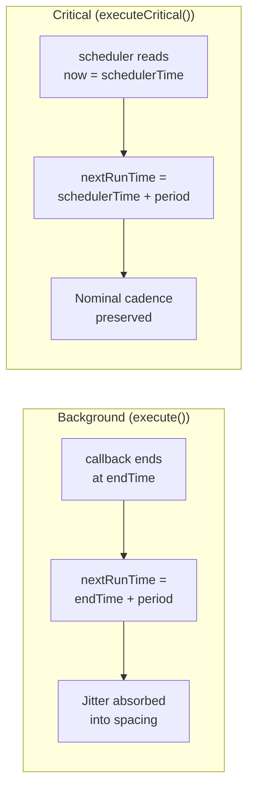

# Timing Semantics

Understanding **when** your task actually fires is the most common source
of confusion. This page is the canonical reference.

## Background tasks (`Scheduler::execute()`)

`execute()` is intended to be called from `loop()`. Each call:

1. Reads `now = timeProvider()`.
2. Scans the background bucket for tasks where `enabled && now >= nextRunTime`.
3. Picks the **single** task with the smallest `nextRunTime` (the
   "earliest-due" task) and invokes its callback.
4. Recomputes `nextRunTime = endTime + period`, where `endTime` is `now`
   measured *after* the callback returns.

### Why one task per call?

A long-running task cannot starve the others. Each `loop()` cycle gives
every task a fair chance, even if one of them happens to be late.

### Reschedule from `endTime` (background)



This makes the task tolerant to its own jitter: the spacing between
*end-of-callback* events stays close to `period` regardless of how long
each invocation takes.

## Critical tasks (`Scheduler::executeCritical()`)

`executeCritical()` is intended to be driven by a dedicated thread (on
ESP32, use `FreeRTOSCriticalRunner`). Each call:

1. Reads `now = timeProvider()`.
2. Iterates the critical bucket in registration order; runs *every*
   task that is due.
3. Recomputes `nextRunTime = schedulerTime + period`, where
   `schedulerTime` is the `now` captured at step 1 (**not** end-of-callback).

### Reschedule from `schedulerTime` (critical)



This preserves the *nominal* cadence: with a 50 ms period, critical
tasks fire at 50, 100, 150, … even if a particular invocation
overshoots, the next deadline is still measured against ideal time.

### Background vs Critical — reschedule comparison



## Picking the right bucket

| You need… | Use |
|---|---|
| 50–500 ms control loop, sensor sampling, motor PID | **Critical** (with `FreeRTOSCriticalRunner` on ESP32, RP2040, nRF52, STM32, Teensy 4.x) |
| MQTT publish, telemetry, log flush, supervisory checks | **Background** |
| Strict cadence even under varying callback duration | **Critical** |
| Maximum simplicity, single-thread Arduino sketch | **Background** only |

## Jitter expectations

- **Critical (ESP32 / RP2040 / nRF52 / STM32 / Teensy 4.x with FreeRTOSCriticalRunner @ 10 ms tick):** worst-case
  jitter ≈ tick + sum of higher-priority work. Typically < 1 ms on idle
  cores.
- **Background:** jitter ≈ longest other background callback +
  whatever else `loop()` does between `execute()` calls. Keep callbacks
  short to keep jitter bounded.

## Custom time source (tests)

```cpp
unsigned long fakeNow = 0;
unsigned long fakeMillis() { return fakeNow; }

Scheduler sched;
sched.setTimeProvider(&fakeMillis);
// ...advance fakeNow and call sched.execute() to drive deterministic tests.
```
